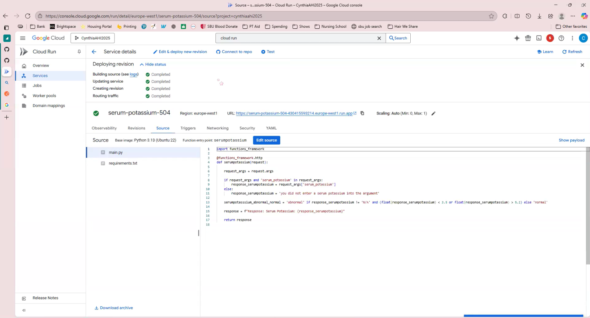
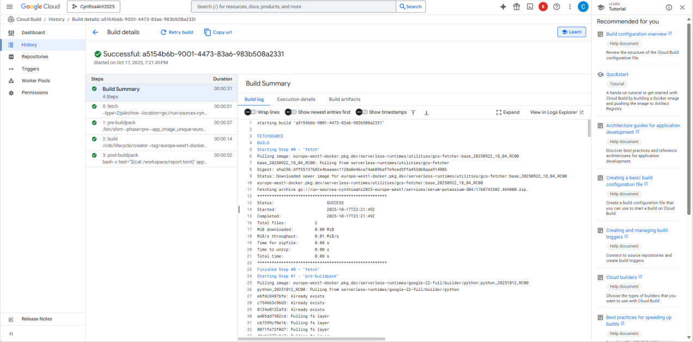
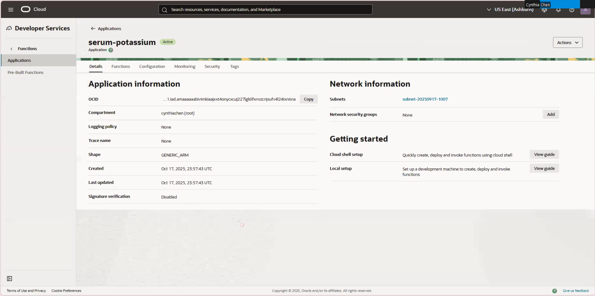

# AHI 504 – Cloud Informatics

### Learning Objectives
- Deploy and invoke HTTP serverless functions across multiple cloud providers.
- Parse JSON payloads and return structured JSON responses.
- Configure authentication for public web access appropriate for a brief demo.
- Compare experience, logs, and deployment across selected clouds.
- Translate a published clinical reference range into executable logic with proper citation.
- Design a clear JSON contract for a simple clinical rule and return a binary result.

---

## Video 
Google Cloud Platform [GCP]: [Creating a Multi-Cloud Serverless Functions](https://drive.google.com/file/d/1C4oXPYCXbqMWZVm7Akj8EjxOOgOC0uJh/view?usp=sharing)

Oracle Cloud Infrastructure [OCI]: [Trying to Create a Multi-Cloud Serverless Functions](https://drive.google.com/file/d/1StzFzEXqhyxyNiBgYO8n2xIR7hZR8F1t/view?usp=sharing)

---

## Deployment commands - Steps
### Google Cloud Platform (GCP)

* To create a Serverless Function:

        1. Open Cloud Run > Services
        2. Click "Write a Function"
        3. Enter Serverless name = serum-potassium
        4. Update Runtime to = python 3.13
        5. Authentication = Allow Public Access
        6. Billing = Requested based
        7. Service Scaling = Max 1; Min 0
        8. Ingress = All 
        9. Create

* Code used in Source:

    ```
    import functions_framework

    @functions_framework.http
    def serumpotassium(request):

        request_args = request.args

        if request_args and 'serum_potassium' in request_args:
            response_serumpotassium = request_args['serum_potassium']
        else:
            response_serumpotassium = 'you did not enter a serum potassium into the argument'

        serumpotasssium_abnormal_normal = 'abnormal' if response_serumpotassium != 'N/A' and (float(response_serumpotassium) < 3.5 or float(response_serumpotassium) > 5.2) else 'normal'

        response = f"Response: Serum Potassium: {response_serumpotassium}"   

        return response

    ```
* GCP Funtionality 
    URl: https://serum-potassium-504-430415593214.europe-west1.run.app/serum_potassium=3.0
         https://serum-potassium-504-430415593214.europe-west1.run.app/serum_potassium=6.8 

    

    

* GCP log 


### Oracle Cloud Infrastrcuture (OCL)

* To create a Serverless Function:

        1. Open Developer Services > Application
        2. Click "Create Applications"
        3. Enter Serverless name = serum-potassium 
        4. Select Shape 
        5. Select Subnet 
        6. Create
        7. Edit Source in Cloud Shell 
        8. Deploy function
        9. Invoke Function
        10. Add API Gateway Endpoint 
            * Developer Services > API Management > Gateways > Create Gateway

* Code used in Cloud Shell:

    ```
    # To Create the files for the codes run:
    fn init --runtime python3.9 serum_potassium
    cd serum_potassium

    # Edit the function files:
    nano func.py

    import io
    import json

    def handler(ctx, data: io.BytesIO = None):
        try:
            # Parse JSON input
            body = json.loads(data.getvalue())
            serum_potassium = body.get("serum_potassium", "N/A")

            if serum_potassium == "N/A":
                message = "You did not enter a serum potassium value."
            else:
                value = float(serum_potassium)
                status = "abnormal" if value < 3.5 or value > 5.2 else "normal"
                message = f"Serum Potassium: {value}, Status: {status}"

            return json.dumps({"response": message})
        except Exception as e:
            return json.dumps({"error": str(e)})

    # Update version
    nano func.yaml

    schema_version: 20180708
    name: serum-potassium
    version: 0.0.1
    runtime: python3.9
    entrypoint: func.handler

    ```

* OCI Deploy 


---

## Short Comparison 
The Google Cloud Platform [GCP] and Oracle Cloud Infrastructure [OCI] both can create a serverless function.  Personally, I believe that GCP works better. Still, I'm not sure about efficiency because I was unable to fully deploy a serverless function on the OCI. However, I was able to create the serverless function itself I wasn't able to complete the deployment with confirmation of a data value. GCP overall was more simplistic, especially in its instructions, and it was more direct in a way compared to OCI. It could be due to OCI's larger capacity of features that made it a little bit harder to understand and a little bit less direct. It wasn't as easy to find certain features, and it didn't really have as many instructions compared to what GCP offered. Overall, both platforms are usable, and they both create what was needed for this assignment, but I do believe the GCP was definitely easier to work with since it has more direct instructions.
